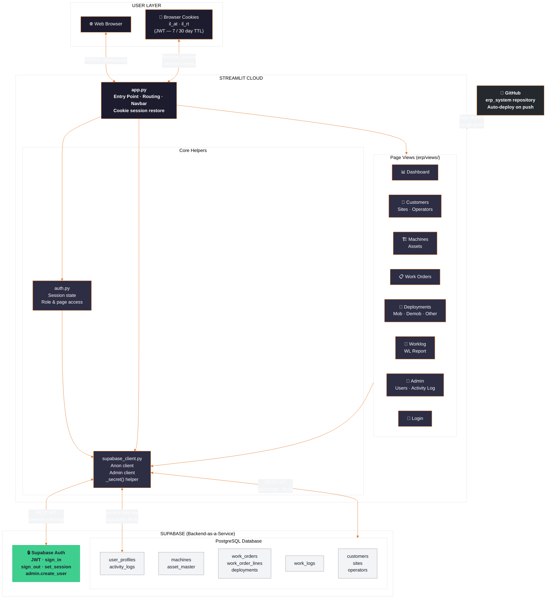

# IRONLINE ACCESS — Solution Architecture

## How to export as image
1. Open [mermaid.live](https://mermaid.live)
2. Paste the diagram code below
3. Click **PNG** or **SVG** to download

---

---

## Tech Stack Summary

| Layer | Technology |
|-------|-----------|
| Frontend | Python · Streamlit 1.36+ |
| Session persistence | streamlit-cookies-controller |
| Database | Supabase PostgreSQL |
| Authentication | Supabase Auth (JWT) |
| ORM / data access | supabase-py (REST) |
| Hosting | Streamlit Community Cloud |
| Source control & CI/CD | GitHub (auto-deploy on push) |
| Config & secrets | Streamlit Cloud Secrets (TOML) |

## Key Features

- **Role-based access control** — Admin sees all pages; User role sees only permitted pages
- **Cookie-based session persistence** — Login survives navbar page reloads
- **Machine deployment workflow** — Mob / Demob / Other with status transitions (Reserved → Mobilizing → On Rent → Demobilizing → Available)
- **Activity audit log** — Every login, user creation, and permission change is recorded
- **Admin panel** — Create users, set page permissions, view full activity log
